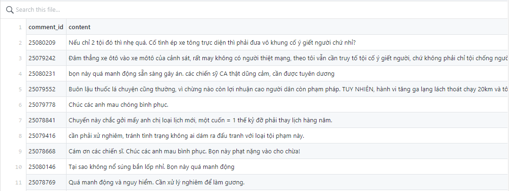

# Comment's VnExpress crawler

Crawler some small comments data of VnExpress.

See the CSV result: [comments.csv](comments.csv)

*Some magic here. Do it at your own risk :)*



# Usage

1. Update `newsurl` URL in [index.js](index.js)
	```js
	var newsUrl = 'https://vnexpress.net/vi-sao-duong-sat-toc-do-cao-di-vong-qua-tinh-nam-dinh-4807531.html';

	```

2. Run the `index.js`
	```bash
	node index.js
	```
	This script will save all comments in the url https://vnexpress.net/xa-hoi-hoa-mot-chiec-laptop-4800323.html into comments.csv and comments.xlsx file

